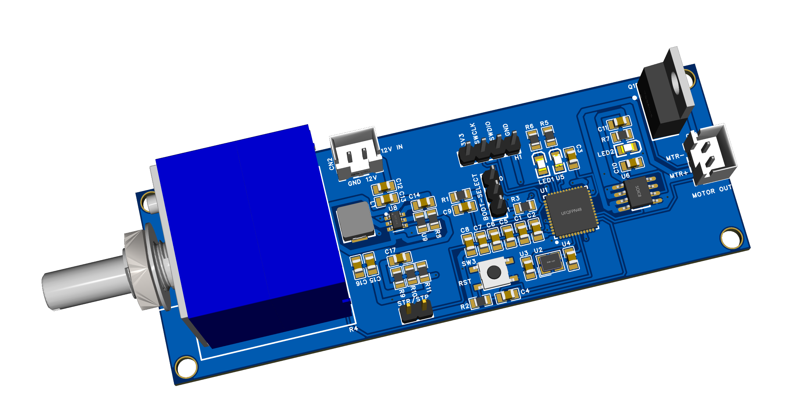
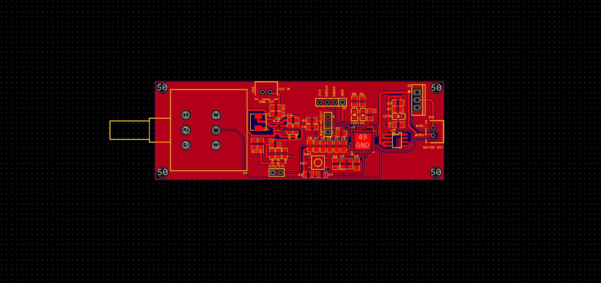
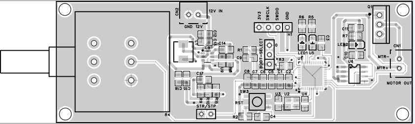

# dc-motor-control-CJ
DC motor control with PWM STM32

### Power supply design

### Current detection and proctection design
To be able to do overcurent proctection, we have to have a means of measuring 
current. I utilized the ACS712 current sensing IC for non-invasive current measurement. According to the motor this board is designed for, I limited the current to 20A.   
This is not a generic board for all motors, therefore the motor specs have been listed in the schematic.

ACS712 is connected in series with the motor and can be used to measure accurately the current being used by the motor, this value then compared to a threshold to detect overcurrent apart from INRUSH CURRENT or MAX-LOAD CURRENT.

### MCU design
I selected STM32F401CCU6 MCU for this design. It is powerful enough and has enough pins and peripherals such as ADC which I heavily utilized for current and PWM motor control 

### Motor design 
The motor that can be used with design is listed below: 

|SPEC|VALUE|
|---|---|
|MAX NOMINAL VOLTAGE| 12V|
|IN-RUSH CURRENT|8A, <45A|
|MAX LOAD CURRENT|<45A|

### MOSFET design 
The currents stated above were determined by the MOSFET I decided to use. I used IRLZ44N, which is a N-channel MOSFET with a MAX Id of 45A, more than capable for the selected motor.

### Schematic files 
Schematic PDF file can be found in the ```schematic``` folder

## PCB Design Files 
Following the schematic above, the following PCB was designed.
### PCB top 


### PCB Top tracks


### PCB top only outline


## Firmware design
### General flow 


### Speed control input signal 

### PWM control signal

### Start/stop

### Status indication 
